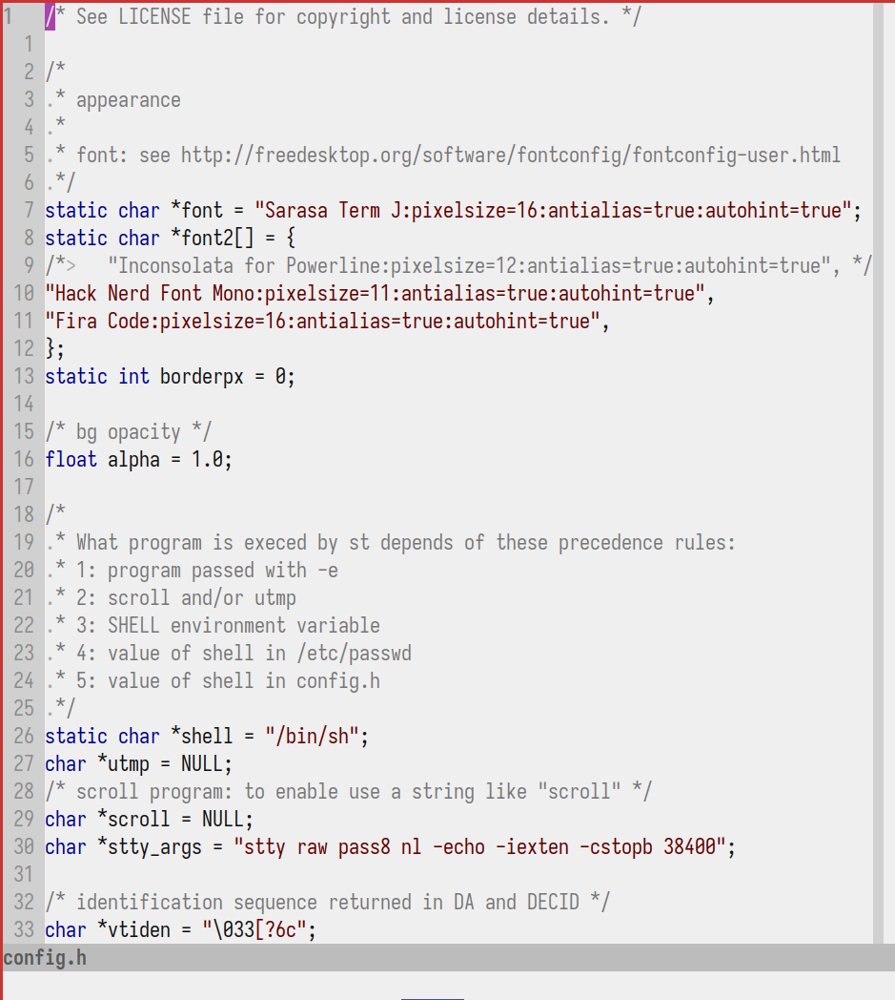
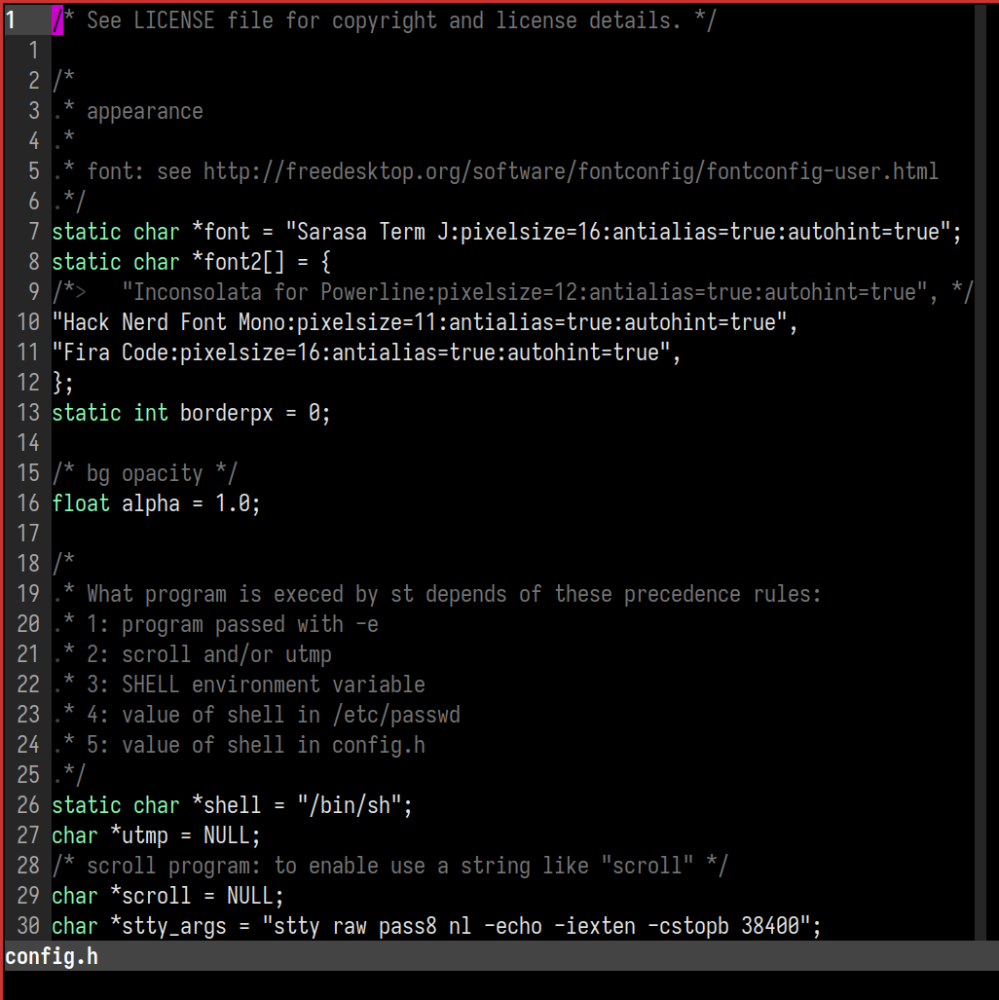

# vim-colorscheme

.
.

The colorscheme I use, to install follow these steps:

1. Place colors.vim into ~/.vim/colors/
2. Add this to your vimrc:

```
set background=light
colorscheme colors
```

3. Set light or dark as preferred
